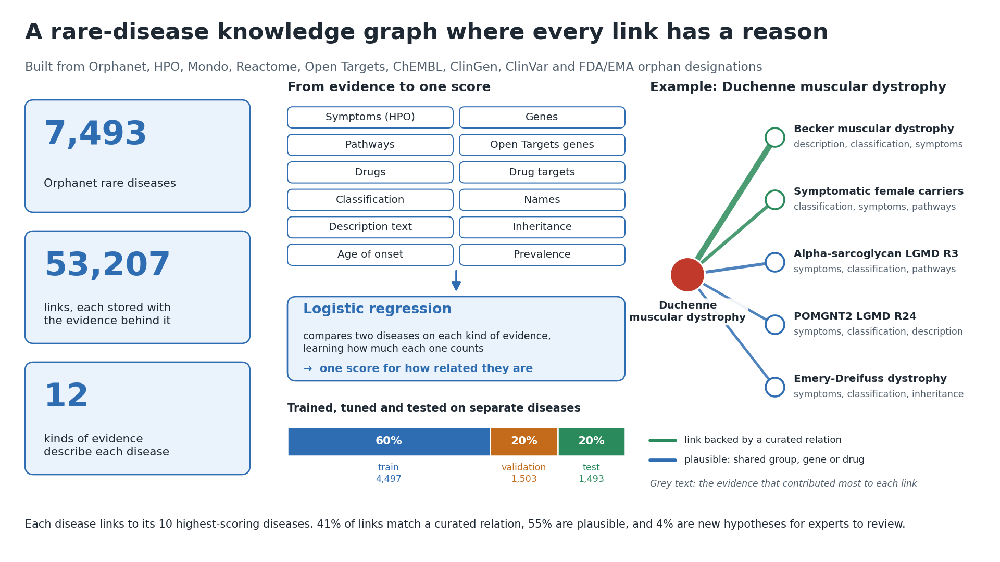
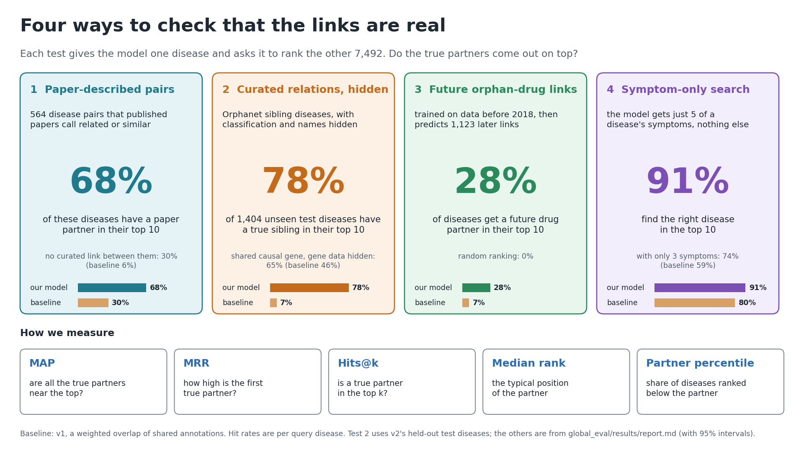

# Rare-disease similarity graph

An explainable map of how rare diseases relate to each other. Every Orphanet rare disease (7,493 of them) is described
by twelve kinds of evidence from public databases. A model learns how much each kind of evidence counts, and each
disease is linked to its ten most similar diseases. Every link records the evidence behind it: shared phenotypes,
genes, pathways, drugs and classification.

Researchers can explore the graph and add a new disease or upload a paper about one, then see where it lands. The
graph can also be searched for drug-repurposing leads. Patients and families can describe their symptoms and see
which groups of conditions they resemble. That view is not a diagnosis.

The original brief is [PROJECT.md](PROJECT.md).



## What the project contains

- **A similarity model (v2, the production model).** Each disease gets twelve sparse profiles: phenotypes, genes,
  pathways, Open Targets genes, drugs, drug targets, classification, names, description text, inheritance, onset and
  prevalence. A non-negative logistic fusion learns how much each profile counts from curated disease relations. For
  each relation type it hides the evidence that relation was built from, so a relation must be recovered from
  independent evidence. The score is additive, so every link's explanation is exact.
- **The graph.** It has 53,207 edges. 41% are backed by a curated relation and 55% are plausible (a shared Orphanet
  group, gene or drug). The remaining 4% are novel hypotheses for experts to review.
- **New-disease placement.** Describe a disease in JSON and get its closest diseases, each with an explanation. A
  paper can also be the input: MedGemma extracts a profile in which every feature is backed by a verbatim quote
  (v2.5).
- **A forward-in-time test (v3).** Models trained only on knowledge from before 2018 are asked to anticipate links
  that regulators established later. Two diseases count as linked once the same drug holds FDA or EMA orphan
  designations for both. v3 also adds a forecast model that ranks pairs as drug-repurposing candidates.
- **A cross-version evaluation** of every model version on four benchmarks that none of them was built around.
- **A web explorer** with a researcher view (graph, filters, edge explanations, adding diseases, uploading papers)
  and a patient view (from symptoms to groups of similar conditions).

## Results

The table shows, for each benchmark, the share of query diseases that have a correct partner among their 10
highest-scored diseases, out of the 7,493-disease catalogue. Source:
[global_eval/results/report.md](global_eval/results/report.md), which also has MAP, MRR, AUROC and 95% intervals.

| Benchmark | v1 baseline | v2 | v3 similarity | v3 forecast |
|---|---|---|---|---|
| Paper-stated pairs (564 pairs that papers call related or similar) | 30% | 64% | 64% | 55% |
| ... only the pairs with no curated relation (the cleanest test) | 6% | 28% | 28% | 20% |
| Orphanet siblings, with classification and names hidden* | 6% | 79% | 76% | – |
| Shared causal gene, with gene data hidden* | 37% | 57% | 60% | – |
| Symptom-only search: 5 of a disease's own symptoms find it | 80% | 91% | 86% | – |
| Forward in time: a drug link formed after the 2018 cutoff | 7% | 28% | 29% | 42% |

What the columns mean:
- **v1** is the original hand-weighted overlap of annotations.
- **v2** is shown without its drug data, so it can be compared like for like with v3, which uses none. With all
  twelve profiles, v2 reaches 68% and 30% on the two paper-pair rows. The symptom row uses all twelve profiles. The
  forward-in-time row uses v2's architecture retrained on data from before 2018.
- **Rows marked \*** are in-sample for v2 and v3, because their production models were fitted on these relations.
  On diseases held out from training, v2 recovers hidden Orphanet siblings with MAP 0.301, against 0.016 for v1 and
  0.003 for random ranking ([v2/README.md](v2/README.md)).

What this means:
- **Learned fusion beats the hand-weighted baseline everywhere.** The clearest case is paper-stated pairs that no
  model was trained on, where the hit rate goes from 6% to 28–30%.
- **v3's neural similarity ties v2; v3's gain is the forecast.** On the forward-in-time test, the forecast reaches MAP
  0.113, against 0.061 for v2's architecture retrained on the same data. That is a different task, though: "diseases
  that already attract drugs attract more" alone reaches 0.070, and the forecast ranks paper-stated similar pairs
  lower than the similarity does.
- **The graph and the patient view therefore use v2.** v2 is also better than v3 at symptom-only search, which is
  what the patient view does.
- **Every model finds which diseases papers relate, but none tracks how strongly the papers relate them.** The
  correlation with the papers' stated similarity is weak for all versions (Spearman 0.19–0.23).



## Model versions

| Version | Approach | Status | Docs |
|---|---|---|---|
| v1 | Weighted overlap (Jaccard) of annotation sets with hand-set weights: the simple approach in `PROJECT.md`. Also supervised models trained on literature scores. | Baseline | `evaluation.py`, `models/` |
| v2 | Twelve sparse profiles, a cosine similarity per profile, and a non-negative logistic fusion trained on masked curated relations | **Production**: graph, explorer, patient view | [v2/README.md](v2/README.md) |
| v2.5 | MedGemma reads a paper and returns a profile in which every feature is backed by a quote; v2 then places it | Used by the explorer's paper upload | [v2_5/README.md](v2_5/README.md) |
| v3 | Drug-free similarity (neural ensemble plus fusion) and a gradient-boosted forecast over time-sliced regulatory evidence | Research; the forecast is for repurposing candidates | [v3/README.md](v3/README.md) |
| v4 | A learned 128-dimensional multimodal embedding mixed with a v2-style fusion | Experimental, in progress | [v4/README.md](v4/README.md) |

## Repository layout

| Path | What it holds |
|---|---|
| `PROJECT.md` | The project brief: goals, data sources, feature ideas and the evaluation plan |
| `download_databases.py` | Downloads the core database bundle to `.data/databases/` |
| `generate_features.py` | Builds Parquet feature tables keyed by ORPHA ID in `.data/features/`, with the source of every row kept |
| `evaluation.py` | v1: an explainable distance between two diseases |
| `splits.py` | Stable, hash-based train/validation/test splits of the literature disease pairs |
| `models/` | v1-era models trained on literature scores: linear classifier, ridge, 7-dimension ridge, Extra Trees, SVD embeddings |
| `literature_review/` | Disease pairs from papers, with per-dimension scores; `acquisition/` holds the Europe PMC and PubMed collector |
| `experiments/` | Self-contained experiments: v1 against the literature scores, richer feature semantics, a dimension-aligned ablation, retrieval over acquired paper text |
| `easy_hard/` | Experiment: predict a similarity built from hard-to-obtain features (genes, pathways, drugs) using only easy ones |
| `v2/`, `v2_5/`, `v3/`, `v4/` | The model versions above, each with its own README, tests and `.data/` outputs |
| `v2_audit/`, `v3_audit/` | Independent audits of v2 and v3: trivial baselines, leakage probes, sensitivity checks |
| `global_eval/` | Cross-version benchmarks and the [comparison report](global_eval/results/report.md) |
| `frontend/` | React explorer, the Python placement API and an optional local MedGemma server |
| `pitch/` | Pitch slides and the script that draws them from the evaluation outputs |

Generated data goes to `.data/` at the root and to `<version>/.data/` inside each version. Both are git-ignored, with
two exceptions that are tracked: v3's production model and cache, and the curated exports of the literature
acquisition release.

## Getting started

### Requirements

- Python 3.10+ with the core packages:

  ```bash
  pip install numpy pandas pyarrow scipy scikit-learn joblib matplotlib networkx requests pytest
  ```

- Optional, depending on what you run:
  - `torch` for v3 and v4 (uses CUDA if available, otherwise falls back to CPU);
  - `transformers`, `accelerate` and `bitsandbytes` for MedGemma (v2.5, patient view, paper upload);
  - `pypdf` for PDF paper uploads.
- Node.js and npm for the explorer.

### 1. Download the databases and build features

```bash
python download_databases.py --dry-run   # list the files and their total size first
python download_databases.py             # core bundle -> .data/databases/
python generate_features.py              # -> .data/features/*.parquet
```

The default bundle covers everything the models need. The larger corpora (ChEMBL, ClinicalTrials.gov, PubMed, Europe
PMC, full Open Targets) are opt-in; see `python download_databases.py --help`.

With the features in place, the v1 metric compares two diseases directly. The example below compares Duchenne and
Becker muscular dystrophy:

```bash
python evaluation.py ORPHA:98896 ORPHA:98895
```

### 2. Train, evaluate and build the v2 graph

```bash
python v2/run_evaluation.py   # ~8 min: train, select on validation, report on held-out test diseases
python v2/build_graph.py      # ~1.5 min: refit on all diseases, write the graph and figures to v2/.data/graph/
python v2/place_disease.py --json v2/examples/new_disease_example.json   # place a new disease
```

[v2/README.md](v2/README.md) explains the input JSON format and the graph files. v3 has the same commands, plus
`v3/regulatory.py`, which builds the dated regulatory ground truth; see [v3/README.md](v3/README.md).

### 3. Run the explorer

```bash
cd frontend
npm install
npm run data               # convert v2's graph for the browser
npm run data:annotations   # gene, symptom, onset and inheritance colouring, and the literature pairs
npm run build
cd ..
python frontend/api/server.py   # placement API and the built app at http://127.0.0.1:8765
```

For development, run `npm run dev` in `frontend/` while the API server is running. The npm data scripts call
`python3`. If that command does not exist (common on Windows), run `python frontend/scripts/build_graph_data.py` and
`python frontend/scripts/build_annotations.py` from the repository root instead.

The patient view and paper upload also need a local MedGemma server:

```bash
python frontend/api/medgemma_server.py --model /path/to/medgemma
```

Symptoms and papers never leave the machine. Without MedGemma, both views still work in a reduced form. See
[frontend/README.md](frontend/README.md).

### 4. Compare all versions

```bash
python global_eval/run.py             # evaluate using cached score matrices -> global_eval/results/
python global_eval/run.py --rescore   # recompute the score matrices first (~5 min on a laptop CPU)
```

### Tests

Each version's tests import modules with the same names (`common`, `metrics`, `modalities`), so run them in
separate processes:

```bash
python -m pytest v2/tests -q
python -m pytest v2_5/tests -q
python -m pytest v3/tests -q
python -m pytest v4/tests global_eval/tests -q
python -m pytest experiments -q
python -m unittest discover -s literature_review/acquisition -p "test_*.py"
cd frontend && npm run test:api
```

## Data sources

- **Default bundle:**
  - Orphanet (Orphadata): diseases, classification, phenotypes, genes, prevalence, inheritance and onset;
  - Human Phenotype Ontology;
  - Mondo;
  - ClinGen and ClinVar;
  - Open Targets: diseases, targets, associations, drugs, clinical indications, mechanisms of action and Reactome
    pathways;
  - FDA and EMA orphan designations.
- **Literature:** Europe PMC and PubMed, collected through their public APIs.

`PROJECT.md` lists further sources. The downloader supports some of them (ChEMBL, ClinicalTrials.gov, PubMed and
Europe PMC bulk data); the rest are not yet used.

## How the evaluation works

There is no single correct measure of disease similarity, so the project follows `PROJECT.md`. The test is whether
known relations rank above unrelated controls, and whether every score can be explained from its sources. In
practice:

- **Held-out data.** v2 splits diseases 60/20/20 by a stable hash and fits encoders and weights on training diseases
  only, so test diseases are never seen. v3 splits by time instead.
- **Masking.** Each relation type hides the profiles derived from its own source. For example, the shared-gene
  benchmark hides gene, pathway and Open Targets data.
- **Four benchmarks with different kinds of ground truth:**
  - curated database relations;
  - disease pairs that published papers describe as related;
  - drug links that regulators established after the training cutoff;
  - symptom-only queries, where the answer is the disease the symptoms came from.
- **Manual review.** `v2/.data/graph/review_top5.md` and `v3/.data/graph/review.md` list the closest diseases to
  well-known diseases. `global_eval/review_sheet.py` produces a blinded sheet of 377 neighbour pairs for clinicians
  to rate.

## Limitations

- **Every benchmark is a lower bound.** The ground truth is database relations, regulatory decisions and papers, not
  clinical truth, and unlabelled pairs count as unrelated.
- **Nothing has been reviewed by experts yet.** The papers acquired by `literature_review/acquisition/` are scored
  automatically and none of the scores has been reviewed. Clinicians have not yet rated the review sheet.
- **Annotations are a 2026 snapshot.** Phenotypes, genes and descriptions carry no dates, so v3's forward-in-time
  test is not strictly time-sliced for those inputs.
- **Novel edges are hypotheses for expert review, not findings.** Nothing here is a diagnostic or clinical
  decision tool.
