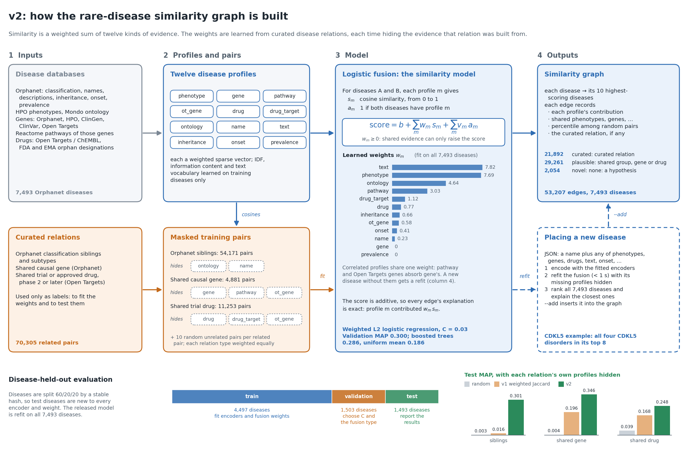

# Rare-disease similarity graph, v2

v2 learns how similar two rare diseases are from the downloaded databases, checks that it recovers curated disease
relations far better than chance on diseases it has never seen, builds an explained similarity graph of 7,493 Orphanet
diseases, and places new diseases into that graph.



It uses only `.data/features/` (built by `generate_features.py`) and `.data/databases/`. It does not read
`literature_review/` or the literature-derived `.data/literature_acquisition/`, `.data/splits/` and `.data/models/`.

## Run

```bash
python v2/run_evaluation.py    # ~8 min: train on train diseases, select on validation, report on test
python v2/build_graph.py       # ~1.5 min: fit on all diseases, write the graph and figures
python v2/place_disease.py --json v2/examples/new_disease_example.json        # place a new disease
python v2/place_disease.py --json v2/examples/new_disease_example.json --add  # ... and insert it into the graph
python v2/place_disease.py --orpha ORPHA:558 --hide ontology,name             # re-place a known disease as if unclassified
python v2/make_schematic.py      # redraw docs/model_schematic.png (needs run_evaluation.py and build_graph.py)
python -m pytest v2/tests -q
```

Outputs go to `v2/.data/`: `evaluation/REPORT.md` (full results), `graph/` (graph files and figures), `model/`.

## How it works

**Disease profiles.** Each disease is described in 12 modalities, each a sparse vector compared by cosine similarity:

| Modality | Content |
|---|---|
| phenotype | HPO terms with ancestors, weighted by Orphanet frequency and information content |
| gene, pathway, ot_gene | Curated genes; their Reactome pathways; Open Targets associations (score >= 0.5) |
| drug, drug_target | Trial/approved drugs and orphan designations; their ChEMBL targets |
| ontology | Orphanet classification and Mondo ancestors |
| name, text | TF-IDF of names/synonyms and of the description (own names, gene symbols and cytobands removed) |
| inheritance, onset, prevalence | Categorical and ordinal kernels |

Weights (IDF, information content, text vocabulary) are learned from training diseases only, so any new disease can be
encoded with the fitted encoders.

**Benchmarks.** Three curated relation types serve as ground truth: Orphanet classification siblings, shared causal
gene (Orphanet), and shared trial drug (Open Targets, phase >= 2). Each benchmark *masks the modalities derived from its
own label source*, for example gene, pathway and Open Targets genes for the shared-gene benchmark. A relation must
therefore be recovered from independent evidence instead of being read back.

**Protocol.** Diseases are split 60/20/20 by a stable hash. Each validation/test disease is a query that ranks all
other eligible diseases. Metrics: per-query AUROC, MAP, MRR, Hits@10, nDCG@10, with 95% bootstrap intervals and paired
Wilcoxon tests. Additional checks:
- a "hard" stratum of relations that cross Orphanet groups;
- related pairs versus clearly unrelated controls;
- a variant without free text;
- a *newly described disease* stress test that also hides Open Targets genes, drugs and classification.

**Models.** The baselines are random ranking and the v1 weighted Jaccard. The v2 candidates are:
- a uniform mean of the modality similarities;
- gradient boosting;
- logistic fusion: logit = b + sum of w_m * similarity_m + v_m * both-annotated_m.

The fusions are trained on masked pairs from all three benchmarks at once. Each modality's weight is therefore learned
only from benchmarks whose labels come from a different source. Similarity weights are constrained to be
non-negative, so every edge explanation is a sum of positive evidence. Logistic fusion was selected on validation
(MAP) and is the graph model.

**New diseases.** A linear fusion cannot shift weight to the gene when a disease lacks the pathway and Open Targets
profiles that normally carry that signal. `place_disease.py` therefore refits the fusion, in under a second, on the
same training pairs with the new disease's missing modalities hidden. This beat the general fusion on validation and
test.

## Results (test diseases unseen during fitting)

| Benchmark | Queries | Random MAP | v1 MAP | v2 MAP [95% CI] | v2 AUROC | v2, new-disease profile MAP |
|---|---|---|---|---|---|---|
| Orphanet siblings | 1,404 | 0.003 | 0.016 | 0.301 [0.285, 0.317] | 0.892 | 0.308 |
| Shared causal gene | 483 | 0.004 | 0.196 | 0.346 [0.313, 0.378] | 0.887 | 0.320 |
| Shared trial drug | 169 | 0.039 | 0.168 | 0.248 [0.215, 0.282] | 0.757 | 0.226 |


- All v2 fusions beat random with p < 1e-20. The production model also beats v1 on every benchmark: +0.285, +0.150
  and +0.080 MAP, with all intervals above zero.
- On the hard relations that cross Orphanet groups, v2 still beats v1: MAP 0.144 vs 0.087 for shared genes and 0.168 vs
  0.110 for shared drugs.
- Known related pairs outrank clearly unrelated controls with probability 0.89 / 0.92 / 0.80.
- Gradient boosting has the highest AUROC. Logistic fusion won on validation macro MAP (0.301 vs 0.286), is clearly
  better on shared genes (test MAP 0.346 vs 0.301), and its additive form gives exact edge explanations.

## The graph

`graph/edges.csv` links each disease to its 10 most similar diseases: 53,207 edges, of which 21,723 are mutual. Each
edge records:
- the score and its percentile among random pairs;
- per-modality similarities and contributions;
- the shared features behind the top modalities (phenotypes, genes, pathways, drugs, ...);
- any curated relation backing it.

Edge support levels:

| Support | Edges | Meaning |
|---|---|---|
| curated | 21,892 | A curated relation backs the edge |
| plausible | 29,261 | Shared Orphanet group, gene or drug |
| novel | 2,054 | None of these; a hypothesis to review |

Other files:
- `rare_disease_graph.graphml` (Gephi/Cytoscape) and `nodes.csv`;
- `embeddings.parquet`: a 128-d fused embedding;
- `review_top5.md`/`.csv`: top-5 neighbours of 20 well-known diseases for manual review. Automatically, 79 of 100
  neighbours have a curated relation and 21 are plausible.


## Placing a new disease

Describe the disease in JSON. Every field is optional except `name`:

```json
{
  "id": "USER:my-disease", "name": "...", "synonyms": ["..."], "description": "free text",
  "phenotypes": {"HP:0001250": 1.0, "HP:0001263": 0.8}, "genes": ["CDKL5"],
  "drugs": ["CHEMBL1234 or a drug name"], "inheritance": ["X-linked dominant"], "onset": ["Infancy"],
  "prevalence": 1e-6, "ontology_parents": ["ORPHA:102369"]
}
```

Accepted values:
- **Phenotype weights:** roughly the share of patients affected. Lists default to 0.5.
- **Inheritance:** autosomal recessive/dominant, X-linked (recessive/dominant), Y-linked, mitochondrial,
  multigenic/multifactorial, oligogenic, semidominant, not applicable, or AR/AD/XLR/XLD.
- **Onset:** Antenatal, Neonatal, Infancy, Childhood, Adolescent, Adult, Elderly, All ages.
- **Prevalence:** a fraction, for example `1e-5` for 1 in 100,000.

Unrecognised values of any field are reported as warnings and ignored. For the example in `examples/` (a CDKL5 epileptic
encephalopathy without an Open Targets profile), the nearest disease is CDKL5-deficiency disorder. All four CDKL5
disorders are in the top 8, each explained by shared phenotypes, name terms and the gene. `--add` appends the disease
and its edges to `nodes.csv`, `edges.csv` and the GraphML. Later placements also consider it as a neighbour.

## Limitations

- Benchmarks are database relations, not clinical truth. Unlabelled pairs count as unrelated, so precision is a lower
  bound.
- Sources overlap: Orphanet groups allelic disorders, and descriptions mention mechanisms. Masking removes each
  benchmark's own source, but not every correlated one.
- Like any kNN graph, it has hubs. A few syndromes with many generic neurodevelopmental phenotypes have degree 60-100.
- The novel edges are hypotheses for expert review, not findings.
