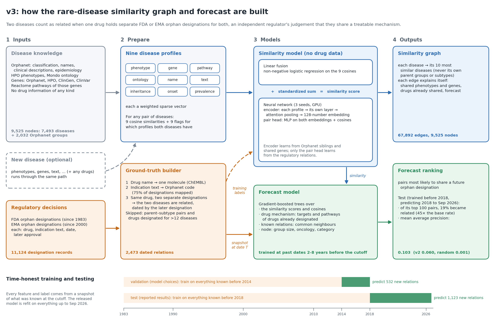

# Rare-disease similarity graph, v3

v3 asks a harder question than v2. Instead of checking that the similarity graph reproduces database relations it was
built next to, it checks that the graph **anticipated regulatory decisions made after its training cutoff**. Two rare
diseases count as related on the date the same drug first holds FDA or EMA orphan designations for both. Models trained
on knowledge before 2018 are scored on the 1,123 relations that regulators established from 2018 to September 2026.



Inputs are `.data/features/` and `.data/databases/` only (including `databases/regulatory/`). No v3 model reads
`literature_review/`, `.data/literature_acquisition/`, `.data/splits/` or `.data/models/`. The one exception is
`evaluate_literature.py`, an external check that scores the finished model against the scraped paper pairs and
fits nothing.

## Run

```bash
python v3/regulatory.py        # parse FDA + EMA designations, map them to Orphanet, write dated relations + audit
python v3/run_evaluation.py    # ~30 min (GPU): validation + test folds, report, figure, production stacker choice
python v3/build_graph.py       # ~45 min: fit on everything up to the end of the data, write the graph and figures
python v3/place_disease.py --json v3/examples/new_disease_example.json        # place a new disease
python v3/place_disease.py --json v3/examples/new_disease_example.json --add  # ... and insert it into the graph
python v3/place_disease.py --orpha ORPHA:558 --hide ontology,name             # re-place a known disease as if new
python v3/evaluate_literature.py  # ~3 min: external check against the scraped paper pairs (needs build_graph.py)
python v3/make_schematic.py       # redraw docs/model_schematic.png
python -m pytest v3/tests -q
```

The neural model uses PyTorch with CUDA if available (tested with torch 2.11 + cu128 on an RTX 5060 Laptop GPU); it
falls back to CPU. Outputs go to `v3/.data/`: `regulatory/` (designations, relations, mapping audit), `evaluation/`
(`report.md`, `summary.json`, per-query metrics, `map_by_model.png`), `graph/`, `model/`.

## Ground truth: dated orphan-designation relations

**Why orphan designations.** A designation is granted only after the regulator accepts the sponsor's scientific
case that the drug is plausible for that rare disease. The FDA requires a "scientific rationale" with supporting data
(21 CFR 316.20), and the EMA's COMP reviews "medical plausibility" (Regulation (EC) No 141/2000). When one molecule
is accepted for two diseases in separate decisions, an independent expert body has judged that the two diseases share
a treatable mechanism. That is the relation a similarity graph for drug repurposing should anticipate. Unlike curated
classifications, each relation has a date, so prediction can be tested strictly forward in time.

**Why it is hard to obtain.** The relations do not exist in any database; `regulatory.py` builds them in four steps:

1. Parse 11,124 designations: 7,902 FDA (since 1983) and 3,222 EMA (since 2000; refusals dropped).
2. Identify each drug as its ChEMBL parent molecule through Open Targets names, synonyms and trade names, with salt
   forms stripped; otherwise use a normalized name key. 6,687 drugs, 45% resolved to ChEMBL.
3. Map the free-text indication ("Treatment of ...") to Orphanet with a tiered matcher. It uses Orphanet names and
   synonyms plus Mondo exact synonyms of Orphanet-equivalent terms, and handles purpose phrases, qualifiers ("... in
   patients with X"), lists ("X and Y", where every piece must map), negations ("non-small cell") and optional
   modifiers ("proximal", "classic"). 8,329 designations (75%) are mapped:

   | Tier | Designations | Audited precision |
   |---|---|---|
   | exact | 6,543 | ~24/25 |
   | contained | 1,428 | ~22/25 |
   | qualifier | 302 | 20/20 |
   | list | 56 | 12/12 |

   The audit sample is in `mapping_audit_sample.csv` and the unmapped wording in `unmapped_indications.csv`.
4. Pair the diseases. A pair needs two distinct designation records, so one joint record never relates its own
   diseases. Pairs where one node is the other's Orphanet ancestor are skipped. The 4 broad drugs designated for more
   than 12 nodes, such as checkpoint inhibitors, create no relations. The pair's date is the first date both
   designations were held.

This yields 2,473 dated relations among 585 nodes. 306 are "approved both", meaning both designations led to an
approved product. Their number grows from about 10 a year in the 1990s to 100–190 a year since 2014.

**Nodes.** There are 9,525 nodes: the 7,493 Orphanet diseases from v2, plus all 2,032 Orphanet groups with 2–200
member diseases. All eligible groups are included, not only the 158 that were designated. Otherwise being a node would
itself reveal that a group had been designated.

## Protocol

| Fold | Training knowledge | Relations to predict | Queries |
|---|---|---|---|
| validation | before 2014-01-01 (818 relations) | 2014–2017 (532) | 303 |
| test | before 2018-01-01 (1,350 relations) | 2018-01 to 2026-09 (1,123) | 447 |

Leakage controls:
- **Drug-free static profiles.** Each node has nine modalities: phenotype, gene, pathway, ontology, name, text,
  inheritance, onset and prevalence. Unlike v2, it has no drug, drug-target or Open Targets association modality.
  2,086 designated-drug words are removed from the descriptions, for example "imatinib". Biomedical words that are
  also drug names, such as "glutamine" and "factor", are kept.
- **Time-sliced history.** Everything date-dependent is computed from a snapshot at the cutoff: designated drugs,
  their targets and target pathways, the known relation graph, designation counts and years. Models, the stacker's
  training origins and early stopping all use data before the cutoff only.
- **Candidates.** Each query is a node that gains a relation in the window. It ranks all 9,525 nodes, excluding
  itself, nodes it was already related to, and its Orphanet ancestors and descendants. Galleries:
  - `full`: every node;
  - `warm`: only nodes designated before the cutoff, which removes the "has this disease ever been designated"
    signal;
  - `full_approved`: positives restricted to approved-both relations.
- **Metrics.** Per-query MAP (primary), AUROC, MRR, Hits@10, nDCG@10 and Recall@50, with bootstrap 95% CIs and paired
  one-sided Wilcoxon tests. Also reported: strata (warm/cold, group/disease, oncology) and the global precision@K of
  new pairs among designated diseases.

The production stacker variant and the neural settings were chosen on validation only, and no modelling choice used
the test fold. Both folds were re-run once after a benchmark fix: disorder–subtype pairs, like group–member pairs,
can never become relations, so they are now excluded from the candidates too. No model setting changed.

## Models

**Static similarity (drug-free, works for any new disease).**
- `v2_shipped`: v2's production logistic fusion, with v2's drug modalities removed.
- `v2_retrained`: the same architecture refit on regulatory relations: non-negative logistic fusion of the nine
  cosines plus availability terms.
- `gbm_static`: gradient boosting on the same inputs.
- `v3_neural`: a multi-task neural network, run as a 3-seed ensemble on the GPU:
  - each modality is projected from its sparse vector to 64 dimensions, then attention pooling with a null token
    gives a 128-d disease embedding;
  - modality dropout is 0.2;
  - a symmetric pair MLP reads [z_a ⊙ z_b, |z_a − z_b|, cosines, availability], plus a non-negative "wide" linear
    term.
  
  It trains on three tasks: regulatory relations before the cutoff, Orphanet siblings (with ontology and name
  hidden), and shared causal genes (with gene and pathway hidden). The embedding learns only from the two auxiliary
  tasks; the therapeutic head learns on top of it. Training the encoder on the 800–1,400 therapeutic pairs made it
  memorize which diseases attract drugs.
- `v3_static`: the standardized sum of `v3_neural` and `v2_retrained`. This is the graph's similarity score.

**Forecast (`v3_stacker` and ablations).** Gradient boosting over five feature families:
- **static:** the three static logits, nine cosines, and the best static score to each disease's known relatives;
- **history:** designation counts, years since the first designation, relation degree, drugs already shared;
- **mechanism:** target and target-pathway overlap of designated drugs, and one disease's genes or pathways
  targeted by the other's drugs;
- **graph:** common neighbours, Adamic–Adar and Jaccard over known relations;
- **node:** group/disease, group size, oncology, same top-level category.

It is trained on rolling origins 2, 4, 6 and 8 years before the cutoff. At each origin, the features come from that
origin's snapshot and a static model trained before it, and the labels are the relations formed between that origin
and the cutoff. Negatives are sampled separately among warm and cold nodes and reweighted to the true mix.

**Reference baselines:** random; degree, which ranks by designation count and relation degree; Adamic–Adar on the known
relation graph; drug-mechanism overlap; and the v1 weighted Jaccard without its drug annotations.

## Results


Test fold (knowledge before 2018, relations from 2018 to 2026-09), all 9,525 nodes as candidates, 447 queries:

| Model | MAP [95% CI] | AUROC | Hits@10 | Recall@50 |
|---|---|---|---|---|
| random | 0.001 | 0.497 | 0.000 | 0.003 |
| v1 weighted Jaccard | 0.014 [0.011, 0.018] | 0.767 | 0.067 | 0.089 |
| drug mechanism | 0.038 [0.027, 0.049] | 0.674 | 0.159 | 0.136 |
| Adamic–Adar | 0.050 [0.040, 0.062] | 0.597 | 0.251 | 0.165 |
| degree | 0.070 [0.060, 0.080] | 0.899 | 0.385 | 0.295 |
| v2 shipped | 0.060 [0.048, 0.073] | 0.807 | 0.233 | 0.218 |
| v2 retrained | 0.061 [0.049, 0.072] | 0.841 | 0.277 | 0.251 |
| v3 neural | 0.066 [0.055, 0.079] | 0.859 | 0.300 | 0.265 |
| v3 static (graph similarity) | 0.064 [0.053, 0.076] | 0.860 | 0.293 | 0.267 |
| v3 stacker, all features | 0.107 [0.092, 0.123] | 0.934 | 0.414 | 0.382 |
| **v3 stacker without history (production)** | **0.103 [0.088, 0.120]** | **0.922** | **0.409** | **0.367** |

- **The production forecast beats v2 on future relations.** Its test MAP is higher than v2 shipped by +0.043
  [+0.029, +0.058] (p = 1e-20) and higher than v2 retrained by the same amount. It also beats the degree baseline by
  +0.034 [+0.015, +0.052]. That baseline is hard to beat, since "diseases that already attract drugs attract more"
  reaches AUROC 0.90. The "no history" variant won validation narrowly over the full stacker (0.088 vs 0.084, not
  significant) and ranks pairs without using designation counts.
- **The static similarity improves only modestly.** On the test fold, v3 static beats v2 retrained by +0.004 MAP
  [+0.001, +0.006] and +0.019 AUROC, both p < 1e-14. On validation it trails on MAP (−0.004) and leads on AUROC
  (+0.017). Against v2 shipped, the test MAP gain is +0.004 [−0.002, +0.010], an interval that includes zero, while
  the AUROC gain is +0.053. In the warm gallery, where every candidate was already designated, v3 static leads v2
  shipped (0.148 vs 0.134). In short, the multi-task network on its own adds little over logistic fusion. The large
  gain comes from combining static similarity with time-sliced regulatory evidence.
- **Static similarity matters most inside the stacker.** Removing it lowers test MAP from 0.107 to 0.072, and
  permutation importance ranks it first (AUC drop 0.28, versus 0.04 for history).
- **Global precision.** Among the 201,410 pairs of already-designated diseases, 0.42% become related after 2018.
  The production model's top 100 pairs have 19% precision (45× the base rate), and its top 500 have 16% (38×).
  Adamic–Adar on the known relation graph is as precise at the very top (26% of its top 100).
- **Strata.** On test queries never designated before the cutoff ("cold", 94 queries), the production model matches
  static similarity (0.095 vs 0.085 MAP). The full stacker, which relies on designation history, drops to 0.066.
  History and graph features help most for oncology (0.143 vs 0.043 for static) and for Orphanet groups (0.094 vs
  0.041).
- **Approved-both relations** (46 test queries): MAP is 0.126 for the production model and 0.177 for the full
  stacker, versus 0.046 for v2 shipped. The intervals are wide.
- **Resampling noise.** The stackers' negatives are sampled, so their test MAP moves by about ±0.005 between
  reruns. That is well inside the margins above.

The full tables (all galleries, both folds, strata, paired tests) are in `.data/evaluation/report.md`.

### External check: scraped paper pairs

`evaluate_literature.py` takes the 4,810 disease pairs from `.data/literature_acquisition/papers.sqlite`, each a
pair that a paper discusses together, with automated 0–4 scores on five similarity dimensions. It aggregates them
as `v2/evaluate_literature.py` does and scores the frozen production model on the 4,688 pairs that are v3 nodes,
the same pairs v2 was scored on. Results are in `.data/literature_validation/`.

| Share of paper pairs | v2 similarity | v3 similarity | v3 forecast |
|---|---|---|---|
| in the top 10% of random pairs | 79.7% | 69.5% | 82.1% |
| in the top 1% of random pairs | 43.2% | 34.9% | 50.9% |
| direct top-10 graph edge | 24.8% (131×) | 21.0% (141×) | – |
| Spearman with paper score strength | 0.039 | 0.043 | −0.001 |

- **Which pairs are related: yes.** Paper pairs sit far above random pairs in every v3 score. 199 of them (4.2%)
  are already v3 regulatory relations, against 0.0055% of random pairs, so the paper benchmark and the designation
  ground truth largely agree on which diseases go together.
- **v3's similarity ranks paper pairs lower than v2 did, and drug data explains most of the gap.** On the 2,153 pairs
  where v2 had drug data for both diseases, 88.8% are in v2's top decile, 72.2% in v3's drug-free similarity and
  91.2% in v3's forecast. Without drug data the figures are 72.0%, 67.3% and 74.3%. v3 removed drugs from similarity
  because shared drugs are now the target. Separately, the 87 disorder–subtype pairs are all in the top 1% but are
  excluded from v3's graph edges by design.
- **How strongly related: no.** Neither version ranks the papers' high-strength pairs above their low-strength ones.
  Correlations with each paper dimension stay below 0.08: phenotype similarity 0.05, gene and inheritance 0.08,
  pathway 0.01, onset −0.05, and forecast against therapeutic similarity 0.02. v2 and v3 agree with each other on
  these pairs (Spearman 0.92), so the low numbers come from the paper scores rather than from one model. Those scores
  carry little strength information: all 14,097 are automated and unverified, and 97% are 1 ("weak or broad
  relationship") or 2; only 1.1% are 3 or 4.

## The graph

`build_graph.py` refits everything on the full history up to 2026-09-30:
- the static model on all 2,473 relations;
- the production stacker on origins 2018, 2020, 2022 and 2024.

It then links each of the 9,525 nodes to its 10 most similar nodes by the drug-free similarity. A node's own
Orphanet ancestors and descendants are not linked, since they are trivially similar. The result is 67,892 edges,
27,358 of them mutual, forming a single connected component. Each edge in `graph/edges.csv` records:
- the similarity and its percentile among random pairs;
- the forecast that the pair will be linked by a future designation, with its percentile;
- per-modality cosines and neural occlusion values;
- the shared items behind the top modalities;
- regulatory evidence: shared drug targets, genes targeted by the other disease's drugs, and common regulatory
  relatives;
- any existing designation relation, with its year and drugs.

| Support | Edges | Meaning |
|---|---|---|
| regulatory | 352 | The pair already shares a drug through two separate designations |
| plausible | 43,785 | Shared Orphanet parent (or parent–child), curated gene, drug target, or a gene targeted by the other's drugs |
| novel | 23,755 | None of these; a hypothesis to review |

The graph is a similarity graph, and most regulatory relations are not similarity edges. Of the 2,473 relations,
352 are among the top-10 edges. The others link diseases that are related but are not each other's nearest
neighbours; the forecast score is meant to find those.

In the production fusion, the largest similarity weights are ontology (6.2), phenotype (3.8) and pathway (2.9). The
gene weight is small (0.3) because the pathway modality already carries most of the gene signal. The production
stacker relies mainly on the static scores (permutation AUC drop 0.33) and the relation graph (0.07).

Other files:
- `forecast_pairs.csv`: the 2,000 pairs not yet linked that the stacker ranks highest, the top 300 with
  explanations. 44 of them, 11 in the top 100, already share a drug through one joint designation record, flagged in
  `joint_designation_drugs`.
  
  Examples from the top 10: Takayasu arteritis with giant cell arteritis, microscopic polyangiitis with granulomatosis
  with polyangiitis, Dravet syndrome with early-infantile developmental and epileptic encephalopathy, and mild
  hemophilia A with von Willebrand disease.
- `rare_disease_graph.graphml` (Gephi/Cytoscape) and `nodes.csv`.
- `embeddings.parquet`: the 128-d neural disease embedding, averaged over the ensemble.
- `review.md` and `review_top5.csv`: the top-5 neighbours of 16 well-known diseases for manual review (80
  neighbours: 9 regulatory, 56 plausible, 15 novel), plus the top 25 forecasts.
- `graph_overview.png` (t-SNE of the embeddings), `ego_duchenne_muscular_dystrophy.png`, `ego_cystic_fibrosis.png`.


## Placing a new disease

Describe the disease in JSON; every field is optional except `name`. The fields match v2, plus `oncology`:

```json
{
  "id": "USER:my-disease", "name": "...", "synonyms": ["..."], "description": "free text",
  "phenotypes": {"HP:0001250": 1.0, "HP:0001263": 0.8}, "genes": ["CDKL5"],
  "drugs": ["CHEMBL1234 or a drug name"], "inheritance": ["X-linked dominant"], "onset": ["Infancy"],
  "prevalence": 1e-6, "ontology_parents": ["ORPHA:102369"], "oncology": false
}
```

`drugs` are treated as orphan-designated today. They feed only the forecast, through shared targets and genes
targeted by the other disease's drugs; the similarity stays drug-free. Neighbours are ranked by similarity
(`--rank-by forecast` is available). Each neighbour is listed with:
- its similarity and forecast percentiles against random pairs;
- the modalities behind the score: linear contribution, neural occlusion (the drop when the modality is withheld from
  both diseases), and the shared items;
- regulatory evidence: shared drug targets, and genes targeted by the other disease's drugs.

`--add` appends the disease and its edges to `nodes.csv`, `edges.csv` and the GraphML, and records it in
`user_diseases.jsonl`. Later placements are compared against it as well.

**Example.** `examples/new_disease_example.json` describes a CDKL5 epileptic encephalopathy by phenotypes, gene,
inheritance, onset and description, with one drug (ganaxolone). It has no Orphanet classification.
- **Similarity.** The nearest node is CDKL5-deficiency disorder (above 99.6% of random pairs), explained by shared
  phenotypes (epileptic spasms, cerebral visual impairment), onset, name terms and the gene CDKL5. Next come
  infantile epileptic spasms syndrome, two infantile epileptic encephalopathies and atypical Rett syndrome.
- **Forecast.** Ganaxolone's GABA-A receptor targets match drugs already designated for several of these neighbours.
  That raises their forecast above the 99.6th percentile; Lennox-Gastaut syndrome is at 99.97%. Atypical Rett
  syndrome, with no such drugs, stays at the 60th percentile.

**Re-placing a known disease.** `--orpha ORPHA:558 --hide ontology,name` re-places Marfan syndrome as if it were
new and unclassified. Its own subtypes are excluded as nested. From phenotypes, TGF-β/elastic-fibre pathways and FBN1
alone, it finds Loeys-Dietz syndrome, aneurysm-osteoarthritis syndrome, neonatal Marfan syndrome, Weill-Marchesani
syndrome and familial thoracic aortic aneurysm in the top 6.

## Limitations

- **Static annotations are a 2026 snapshot.** Orphanet phenotypes, genes and descriptions carry no dates, so a
  description written after 2018 could reflect knowledge the 2018 model would not have had. Drug names are removed
  from the text, and genes and phenotypes are not drug data. Still, the static inputs are not strictly time-sliced.
  v2 shipped's weights were also fitted on 2026 data, which can only favour v2 in the comparison.
- **The relations are a lower bound.** An unrelated pair may simply not have been tried; sponsors' commercial
  choices shape designations, and oncology is over-represented. A quarter of designations stay unmapped, and the
  "contained" tier has about 10% mapping errors, usually a too-coarse group.
- **Drug identity is approximate.** 45% of drugs resolve to ChEMBL; the rest match by normalized name, so two names
  of one molecule can split one drug into two, losing relations.
- **The absolute numbers are modest.** For 40% of query diseases, a future relation appears in the top 10 of 9,525
  candidates. That is far above chance and v2, but most top-ranked pairs have not, or not yet, been linked by a
  regulator. The graph's edges are hypotheses to review, not findings.
